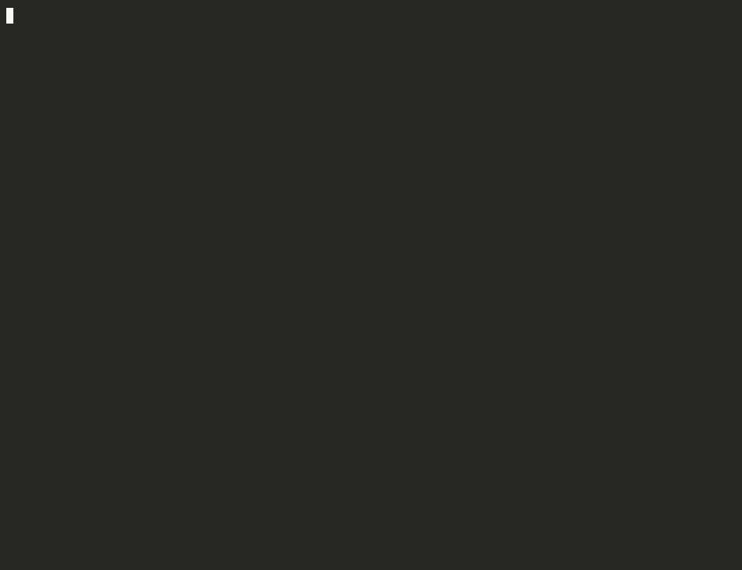

```
    _                     _        _
   | |                   | |      | |
   | |     ___ _ __  ___  | |_ ___| |
   | |    / _ \ '_ \/ __| | __/ __| |
   | |___|  __/ | | \__ \ | |_\__ \_|
   |______\___|_| |_|___/  \__|___(_)
```

# **Run the scientific method on your LLM agent.**

State a hypothesis. Fork. Compare. Know if it actually worked.

[](https://pypi.org/project/agentlens-tracer)
[](https://github.com/RAJUSHANIGARAPU/agent-lens/actions)
[](LICENSE)
[](https://www.python.org)
[](https://codecov.io/gh/RAJUSHANIGARAPU/agent-lens)
[](https://colab.research.google.com/github/RAJUSHANIGARAPU/agent-lens/blob/main/notebooks/quickstart.ipynb)

---



> State a hypothesis. Fork. Run `GET /diff`. Get `verdict: "improved"` — with numbers.

---

## What is agent-lens?

A local-first debugger for LLM agents that turns vibes-based prompt iteration into a measurable experiment.

The standard loop today:
1. Agent fails. You guess what went wrong.
2. Edit the code, restart, wait through every step again.
3. Look at the new output. Decide if it's better. Repeat.

You burn 10 minutes per hypothesis and you have no record of *why* you made each change. agent-lens replaces this with:

1. **Pause** the running agent at any LLM call.
2. State a **hypothesis** (`notes: "shorter system prompt should reduce hallucination"`) and an **expected outcome** (`expected_output: "concise"`).
3. **Fork** with edited messages. The original keeps running.
4. **Diff** the two runs. Get `verdict: improved`, `regressed`, or `neither_pass` — and a structural diff of every message, response, and metric.

You're left with a versioned record of every hypothesis you tested. Future-you (or your teammate) can read your reasoning, not just see the final code.

---

## Quickstart (60 seconds, no API key)

Paste this into a terminal. No API key, no account, no Docker — it records two runs in a throwaway
local database, forks the second from the first with a stated hypothesis, and asks the diff
endpoint whether the hypothesis held.

```bash
pip install agentlens-tracer
python - <<'PY'
import json
import tempfile
import time
import urllib.request
import uuid

import agent_lens
from agent_lens.models import Event, EventType, Run, RunStatus, Span
from agent_lens.store import Store

store = Store(path=tempfile.mktemp(suffix=".db"))  # throwaway db, nothing to clean up
url = agent_lens.dashboard.start(store=store, open_browser=False)

now = time.time()
run_a, span_a = str(uuid.uuid4()), str(uuid.uuid4())
run_b, span_b = str(uuid.uuid4()), str(uuid.uuid4())
verbose = "A long, thorough, pedagogical answer covering every edge case."
concise = "A concise answer."

# Run A - the baseline.
store.save_run(Run(id=run_a, name="verbose_agent", status=RunStatus.COMPLETED,
                   start_time=now - 3, end_time=now - 1.2))
store.save_span(Span(id=span_a, run_id=run_a, name="chat.completions", type="llm",
                     start_time=now - 3, end_time=now - 1.2))
store.save_event(Event(run_id=run_a, span_id=span_a, type=EventType.LLM_END,
                       timestamp=now - 1.2,
                       data={"latency_ms": 1847, "total_tokens": 453, "cost_usd": 0.0045,
                             "response": {"choices": [{"message": {"content": verbose}}]}}))

# Run B - a fork of A, carrying the hypothesis and the assertion.
store.save_run(Run(id=run_b, name="concise_agent", status=RunStatus.COMPLETED,
                   start_time=now - 1, end_time=now - 0.2,
                   parent_run_id=run_a, fork_span_id=span_a,
                   notes="Hypothesis: a shorter system prompt reduces verbosity",
                   expected_output="concise"))
store.save_span(Span(id=span_b, run_id=run_b, name="chat.completions", type="llm",
                     start_time=now - 1, end_time=now - 0.2))
store.save_event(Event(run_id=run_b, span_id=span_b, type=EventType.LLM_END,
                       timestamp=now - 0.2,
                       data={"latency_ms": 820, "total_tokens": 87, "cost_usd": 0.00087,
                             "response": {"choices": [{"message": {"content": concise}}]}}))

# GET /runs/{a}/diff/{b} - the same endpoint the dashboard calls.
for _ in range(20):
    try:
        raw = urllib.request.urlopen(f"{url}/runs/{run_a}/diff/{run_b}", timeout=3).read()
        break
    except OSError:
        time.sleep(0.5)
else:
    raise SystemExit("dashboard never answered - is port 7878 already in use?")

diff = json.loads(raw)
m = diff["metrics_delta"]
print(f"\nDashboard: {url}")
print(f"Latency: {m['latency_ms']['a']} ms -> {m['latency_ms']['b']} ms ({m['latency_ms']['pct_change']:+.1f}%)")
print(f"Tokens: {m['total_tokens']['a']} -> {m['total_tokens']['b']} ({m['total_tokens']['pct_change']:+.1f}%)")
print(f"Verdict: {diff['assertion_result']['verdict']}")
PY
```

`Verdict: improved` is the product in one line: the assertion attached to run B
(`expected_output: "concise"`) failed in A and passed in B, and you have the token and latency
numbers to go with it. The script uses a temporary database and exits as soon as it prints, so the
dashboard shuts down with it — for a dashboard you can click through, drop the `path=` argument
(traces then persist to `~/.agent-lens/runs.db`) and run `agent-lens dashboard` in a second
terminal.

---

## Trace a real OpenAI agent (requires `OPENAI_API_KEY`)

Unlike the quickstart above, this one makes real, billable API calls: it needs
`pip install agentlens-tracer openai` and `OPENAI_API_KEY` exported in your environment.

```python
import agent_lens
from openai import OpenAI

agent_lens.install()          # auto-patch OpenAI + Anthropic + LangChain
agent_lens.dashboard.start()  # localhost:7878

client = OpenAI()

@agent_lens.trace
def my_agent(query: str) -> str:
    return client.chat.completions.create(
        model="gpt-4o-mini",
        messages=[{"role": "user", "content": query}]
    ).choices[0].message.content

my_agent("Explain Python 3.12 typing improvements")
```

Dashboard opens. Every LLM call is traced. Pause, fork, diff — all from the browser or the API.

---

## The four killer endpoints

No other observability tool — Langfuse, LangSmith, Phoenix, AgentOps, Helicone — has any of these.

### 1. Fork with hypothesis + assertion

```http
POST /runs/{run_id}/fork
{
  "span_id": "abc123",
  "edited_messages": [{"role": "system", "content": "Be concise."}],
  "notes": "Hypothesis: removing role constraint will reduce verbosity",
  "expected_output": "concise"
}
```

Records the *why* alongside the *what*. The note travels with the run forever.

### 2. Compare any two runs

```http
GET /runs/{run_a}/diff/{run_b}
```

Returns:

```json
{
  "messages_diff": [{"role": "system", "a": "...", "b": "...", "changed": true}],
  "metrics_delta": {
    "latency_ms":   {"a": 1200, "b": 800,  "delta": -400, "pct_change": -33.3},
    "total_tokens": {"a": 450,  "b": 180,  "delta": -270, "pct_change": -60.0},
    "cost_usd":     {"a": 0.0045, "b": 0.0018, "delta": -0.0027}
  },
  "response_diff":  {"a": "Verbose answer...", "b": "Concise answer.", "changed": true},
  "thinking_blocks": {"a": [], "b": ["Let me reason step by step..."]},
  "assertion_result": {
    "expected_output": "concise",
    "passed_in_a": false,
    "passed_in_b": true,
    "verdict": "improved"
  }
}
```

Hypothesis confirmed. With numbers. In one HTTP call.

### 3. Trace the lineage of every fork

```http
GET /runs/{run_id}/lineage
```

Walks the full ancestry chain. Useful when you've forked five times trying to fix the same bug — see every hypothesis in chronological order.

### 4. Annotate any run after the fact

```http
POST /runs/{run_id}/note
{ "notes": "This was the run that finally worked. Reason: temperature=0.2." }
```

Build institutional knowledge into your trace database, not your Slack DMs.

---

## Pause and fork — the runtime control plane

```
[Agent running] → click Pause → agent blocks at next LLM call
                                ↓
                          [Edit messages in dashboard]
                                ↓
                          click Fork → new run diverges
                                ↓
                          click Resume → original continues
                                ↓
                  [Two runs, side by side. GET /diff to compare.]
```

No restarts. No re-running preceding steps. Programmatic too:

```python
from agent_lens.control import ControlPlane

cp = ControlPlane.get_instance()
cp.pause(run_id)
new_run_id = cp.fork(
    run_id=run_id,
    span_id=span_id,
    edited_messages=[{"role": "user", "content": "Different question"}],
    notes="Trying with explicit instructions",
    expected_output="step-by-step",
)
cp.resume(run_id)
```

---

## Why this matters

You're not debugging a function — you're debugging a probabilistic system. Every prompt change is a *hypothesis test*: "this change should improve X without breaking Y." Today, you run that test by eyeballing two outputs in two terminal windows. agent-lens makes the test structural, repeatable, and recorded.

> Vibes-based prompt engineering is debugging without the debugger.
> agent-lens is the debugger.

---

## What else you get

- **Zero infrastructure** — SQLite at `~/.agent-lens/runs.db`. No Docker. No cloud. No tool API keys.
- **Real-time dashboard** — span tree, flame graph timeline, message inspector. Live via SSE.
- **Any framework** — OpenAI, Anthropic, LangChain via callback. Any Python function via `@trace`.
- **Anthropic extended thinking captured** — `thinking_blocks` flow into your traces alongside the response.
- **Self-contained HTML export** — share a single file with a colleague. No login. No dashboard required to view it.
- **Secret redaction** — Bearer tokens, `sk-*` keys, `AIza*`, `sk-ant-*` — stripped before they hit SQLite.

---

## How agent-lens compares

| Feature                               | agent-lens | Langfuse        | LangSmith |
|---------------------------------------|:----------:|:---------------:|:---------:|
| Local-first (no cloud)                | ✅         | Partial         | ❌        |
| Pause live agent mid-run              | ✅         | ❌              | ❌        |
| Fork from any LLM call                | ✅         | ❌              | ❌        |
| **Structural run diff**               | ✅         | ❌              | ❌        |
| **Hypothesis + expected_output**      | ✅         | ❌              | ❌        |
| **Fork lineage trace**                | ✅         | ❌              | ❌        |
| Real-time dashboard                   | ✅         | ✅              | ✅        |
| Multi-framework (OpenAI/Claude/LC)    | ✅         | ✅              | Partial   |
| Data stays on your machine            | ✅         | ❌              | ❌        |
| Zero-infrastructure setup             | ✅         | ❌              | ❌        |
| Secret redaction by default           | ✅         | Partial         | Partial   |
| Anthropic extended thinking captured  | ✅         | ❌              | ❌        |

---

## Compatibility

- Python 3.10, 3.11, 3.12
- OpenAI SDK ≥ 1.0
- Anthropic SDK ≥ 0.20
- LangChain ≥ 0.1 (optional)
- macOS, Linux, Windows

---

## FAQ

**Does it work without OpenAI or Anthropic?**
Yes. Use `@agent_lens.trace` on any Python function. The SDK integrations are optional.

**Does my data leave my machine?**
No. All data is stored in `~/.agent-lens/runs.db`. No telemetry, no callbacks, no network egress.

**Is it production-safe?**
It's designed for development and debugging. The overhead is < 5ms per traced call on local hardware. The dashboard server binds to 127.0.0.1 only — it's not exposed to the network.

**What happens when I restart the dashboard?**
Traces persist in SQLite. Reload the dashboard — your previous runs and forks are still there, with all their notes intact.

**Can I share a trace with a colleague?**
Yes: `agent-lens export <run_id> --output trace.html` generates a self-contained HTML file. Email it, drop it in Slack, archive it in your repo. No agent-lens install needed to view.

**Does the run diff work between unrelated runs, or only fork pairs?**
Any two runs. The endpoint is `GET /runs/{a}/diff/{b}` — useful for comparing the same prompt across model versions, or two production runs with different inputs.

---

## Contributing

See [CONTRIBUTING.md](CONTRIBUTING.md). Bug reports, feature requests, and PRs all welcome.

## License

MIT — see [LICENSE](LICENSE).
